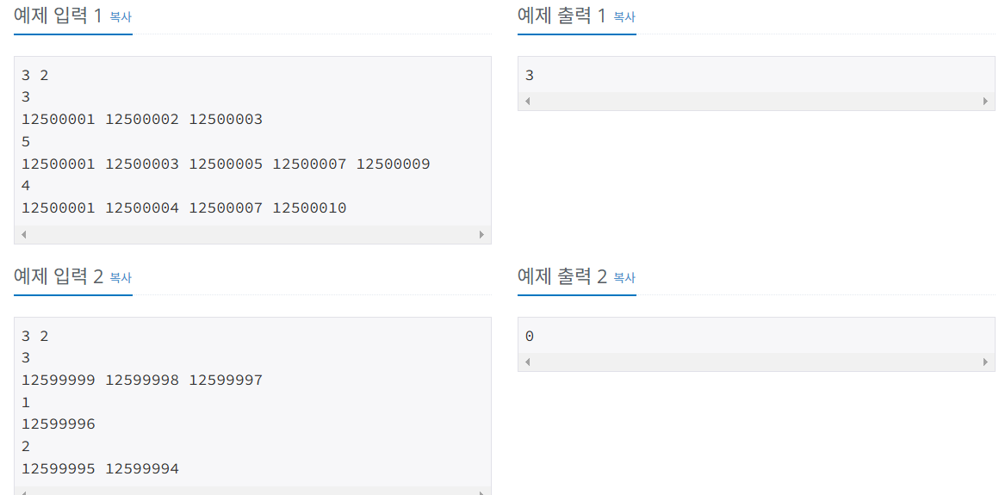

# 항해99 클럽 5기 1일 1코테로 습관 만들기
## 2025년 1월 24일 문제 해시
### 백준 32953번 문제 회상

#### 문제설명
* 첫 번째 줄에 $N$, $M$이 차례대로 주어진다. 

* 두 번째 줄부터 $2 \times N$개의 줄에 걸쳐 각 수업에 대한 정보 $N$개가 순서대로 주어진다.

*  $i$번 수업의 정보는 두 개의 줄로 이뤄진다. 첫 번째 줄에 과목의 수강생 수 $K_i$, 두 번째 줄에 $i$번 수업을 들은 학생들의 학번 $K_i$개가 공백 하나로 구분되어 주어진다.

* 학번은 숫자 8개로 구성되며, 항상 $1$로 시작한다. 한 수업에 동일한 사람이 중복되어 있는 경우는 주어지지 않는다.

#### 입출력 예
