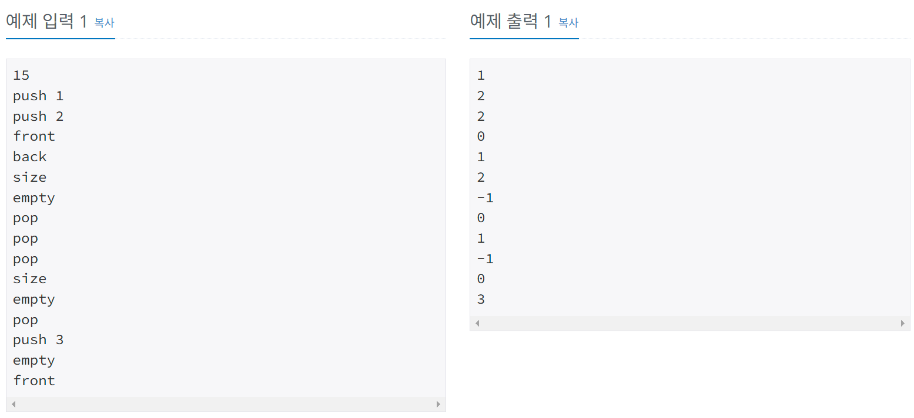

# 항해99 클럽 5기 1일 1코테로 습관 만들기
## 2025년 2월 5일 문제 큐
### 백준 10845번 문제 큐

#### 문제설명
* 정수를 저장하는 스택을 구현한 다음, 입력으로 주어지는 명령을 처리하는 프로그램을 작성하시오.

* 명령은 총 여섯 가지이다.

* push X: 정수 X를 큐에 넣는 연산이다.

* pop: : 큐에서 가장 앞에 있는 정수를 빼고, 그 수를 출력한다. 만약 큐에 들어있는 정수가 없는 경우에는 -1을 출력한다.

* size: 큐에 들어있는 정수의 개수를 출력한다.

* empty: 큐가 비어있으면 1, 아니면 0을 출력한다.

* front: 큐의 가장 앞에 있는 정수를 출력한다. 만약 큐에 들어있는 정수가 없는 경우에는 -1을 출력한다.

* back: 큐의 가장 뒤에 있는 정수를 출력한다. 만약 큐에 들어있는 정수가 없는 경우에는 -1을 출력한다.

#### 입출력 예
