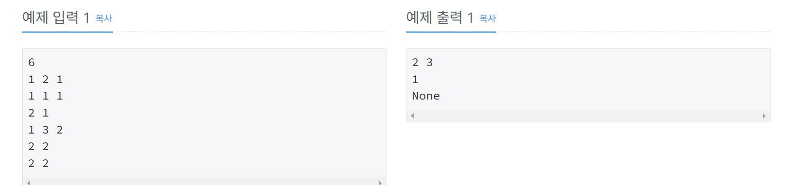

# 항해99 클럽 5기 1일 1코테로 습관 만들기
## 2025년 2월 6일 문제 스택 / 큐
### 백준 26043번 문제 식당 메뉴

#### 문제설명
* S에 저장된 n개의 식당 정보는 아래 두 가지 유형으로 구분된다. 첫 번째가 유형 1, 두 번째가 유형 2다.

* 1 a b: 학생 번호가 양의 정수 a이고 좋아하는 메뉴 번호가 양의 정수 b인 학생 1명이 학교 식당에 도착하여 식당 입구의 맨 뒤에 줄을 서기 시작한다.

* 2 b: 메뉴 번호가 양의 정수 b인 식사 1인분이 준비되어 식당 입구의 맨 앞에서 대기 중인 학생 1명이 식사를 시작한다.

* 식사 1인분이 준비될 때는 식당 입구에서 대기 중인 학생이 항상 존재한다. 식당 입구에 줄을 서서 대기하였으나 식사가 준비 안 된 학생은 식사를 못 한다.

#### 입출력 예
