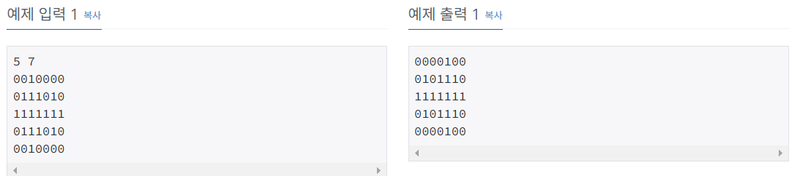

# 항해99 클럽 5기 1일 1코테로 습관 만들기
## 2025년 1월 16일 문제 문자열
### 백준 11945번 문제 뜨거운 붕어빵

#### 문제설명
* 첫째 줄에는 두 개의 정수 N과 M(0≤N,M≤10)이 주어집니다. 
* 둘째 줄부터 N개의 줄에 걸쳐 붕어빵의 모양이 주어집니다. 
* 각 행에는 공백을 나타내는 ‘0‘ 또는 붕어빵을 나타내는 ‘1’이 총 M개 주어집니다. 

#### 제안사항
* 붕어빵은 자유 낙하운동을 하면서 땅에 떨어졌는데 신기하게도 좌우가 뒤집힌 모양으로 착지했답니다.
* 호돌이가 붕어빵을 한 입 물기 전의 모양이 입력으로 주어지면, 땅에 떨어졌을 때에는 어떤 모양일지 출력하세요.

#### 입출력 예
