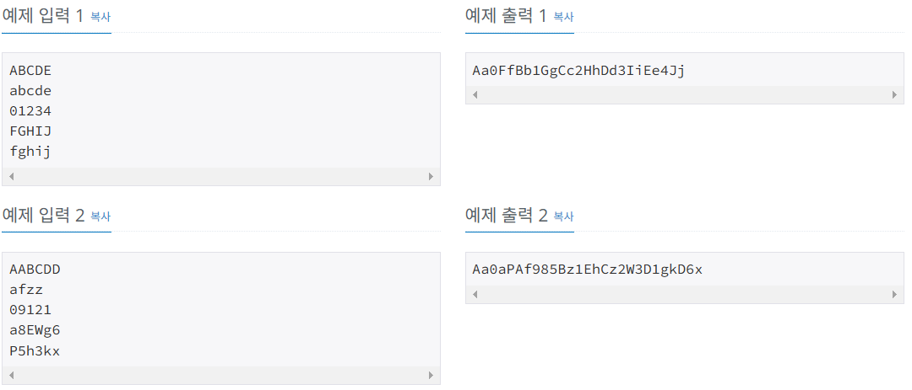

# 항해99 클럽 5기 1일 1코테로 습관 만들기
## 2025년 1월 17일 문제 문자열
### 백준 10798번 문제 세로읽기

#### 문제설명
* 총 다섯줄의 입력이 주어진다. 
* 각 줄에는 최소 1개, 최대 15개의 글자들이 빈칸 없이 연속으로 주어진다. 
* 주어지는 글자는 영어 대문자 ‘A’부터 ‘Z’, 영어 소문자 ‘a’부터 ‘z’, 숫자 ‘0’부터 ‘9’ 중 하나이다. 
* 각 줄의 시작과 마지막에 빈칸은 없다. 

#### 제안사항
* 영석이가 세로로 읽은 순서대로 글자들을 출력한다. 
* 이때, 글자들을 공백 없이 연속해서 출력한다. 

#### 입출력 예
