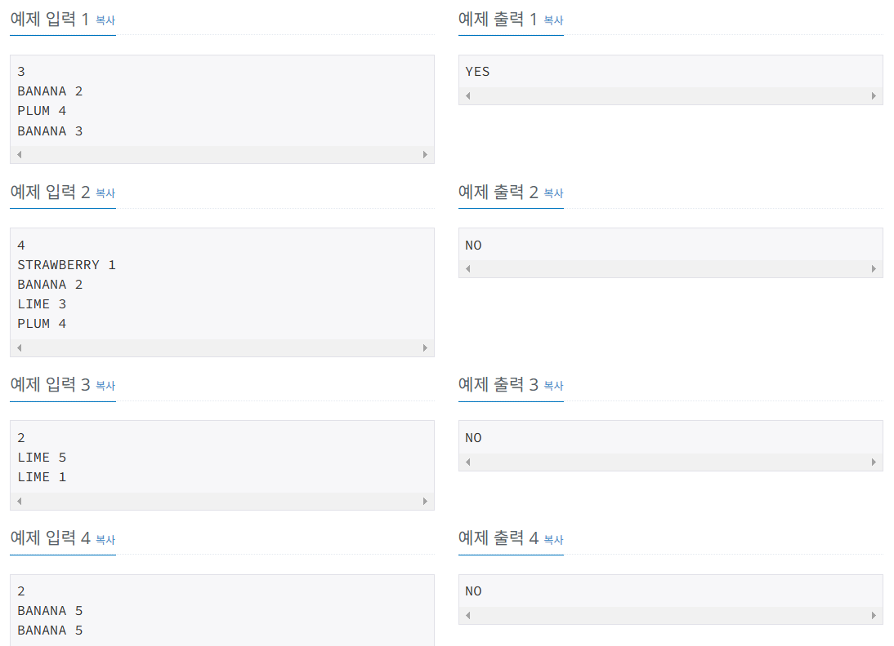

# 항해99 클럽 5기 1일 1코테로 습관 만들기
## 2025년 1월 20일 문제 문자열
### 백준 27160번 문제 할리갈리

#### 문제설명
* 카드에는 총 4종류의 과일이 최개까지 그려져 있습니다. 그려진 과일의 종류는 딸기, 바나나, 라임, 그리고 자두입니다.
* 게임을 시작할 때 플레이어들은 카드 뭉치를 공평하게 나눠가지며 자신이 가진 카드를 전부 소모하면 패배합니다.
* 게임은 시작 플레이어가 본인의 카드 뭉치에서 카드 한 장을 공개하는 것으로 시작합니다. 
* 이후 반시계 방향으로 돌아가며 본인의 카드를 한 장씩 공개합니다.

#### 제안사항
* 첫 번째 줄에 펼쳐진 카드의 개수$N$이 주어집니다. 
* 두 번째 줄부터$N$개의 줄에 걸쳐 한 줄에 하나씩 펼쳐진 카드의 정보가 주어집니다.
* 카드의 정보는 공백으로 구분된, 과일의 종류를 나타내는 문자열$S$와 과일의 개수를 나타내는 양의 정수$X$로 이루어져 있습니다.
* $S$는 STRAWBERRY, BANANA, LIME, PLUM 중 하나입니다.

#### 입출력 예
