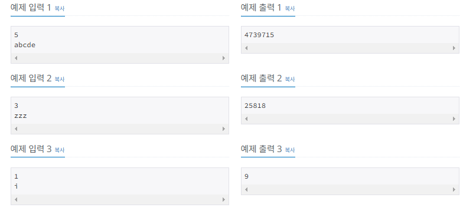

# 항해99 클럽 5기 1일 1코테로 습관 만들기
## 2025년 1월 21일 문제 해시
### 백준 15829번 문제 Hashing

#### 문제설명
* 이 문제에서는 여러분이 앞으로 유용하게 쓸 수 있는 해시 함수를 하나 가르쳐주고자 한다. 
* 먼저, 편의상 입력으로 들어오는 문자열에는 영문 소문자(a, b, ..., z)로만 구성되어있다고 가정하자. 
* 영어에는 총 26개의 알파벳이 존재하므로 a에는 1, b에는 2, c에는 3, ..., z에는 26으로 고유한 번호를 부여할 수 있다. 
* 결과적으로 우리는 하나의 문자열을 수열로 변환할 수 있다. 
* 예를 들어서 문자열 "abba"은 수열 1, 2, 2, 1로 나타낼 수 있다.

#### 제안사항
* 첫 줄에는 문자열의 길이 L이 들어온다. 둘째 줄에는 영문 소문자로만 이루어진 문자열이 들어온다.
* 입력으로 주어지는 문자열은 모두 알파벳 소문자로만 구성되어 있다.

#### 입출력 예
