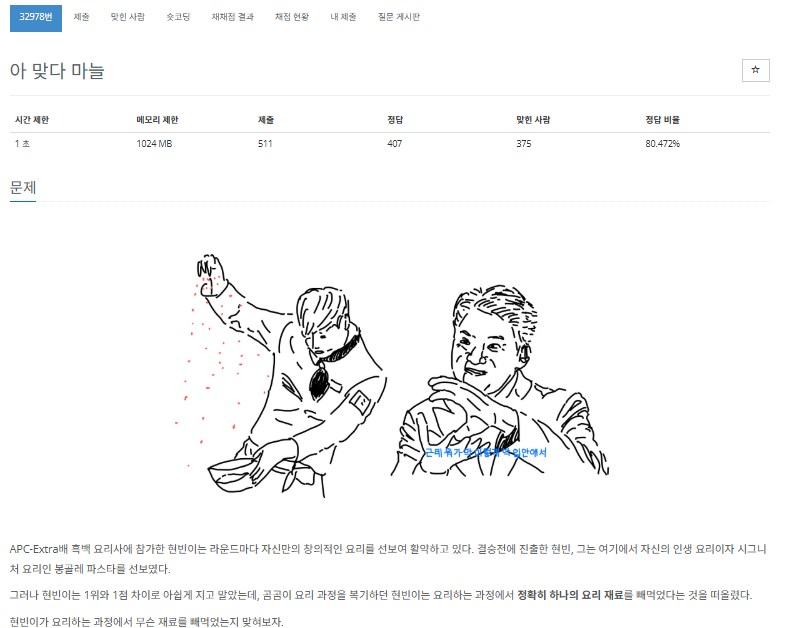

# 항해99 클럽 5기 1일 1코테로 습관 만들기
## 2025년 1월 22일 문제 해시
### 백준 32978번 문제 아 맞다 마늘

#### 문제설명
* 첫 번째 줄에 봉골레 파스타를 만들기 위한 요리 재료 종류의 개수$N$이 주어진다.  

* 두 번째 줄에 봉골레 파스타에 들어가는$N$가지의 요리 재료가 공백으로 구분되어 주어진다. 모든 요리 재료는 한 번씩만 주어진다. 

* 세 번째 줄에 봉골레 파스타에 들어가는$N$가지의 재료 중 현빈이가 사용한$N-1$가지의 요리 재료가 공백으로 구분되어 주어진다. 같은 요리 재료가$2$번 이상 주어지는 경우는 없다.

* 각 재료는 알파벳 대/소문자로 이루어져 있고 길이$20$ 이하의 문자열이다. 같은 철자를 가진 요리 재료이더라도, 대소문자의 여부가 다르다면 두 요리 재료는 다른 요리 재료이다.

#### 입출력 예
