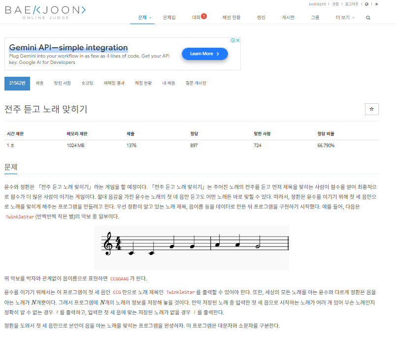

# 항해99 클럽 5기 1일 1코테로 습관 만들기
## 2025년 1월 23일 문제 해시
### 백준 31562번 문제 전주 듣고 노래 맞히기

#### 문제설명
* 첫 번째 줄에 정환이 음을 아는 노래의 개수 $N$, 정환이 맞히기를 시도할 노래의 개수 $M$이 공백으로 구분되어 주어진다.

* 두 번째 줄부터 $N$개의 줄에 걸쳐 노래 제목의 길이 $T$, 영어 대소문자로 이루어진 문자열 노래 제목 $S$, 해당 노래에서 처음 등장하는 일곱 개의 음이름  $a_1, a_2, a_3, a_4, a_5, a_6, a_7$이 공백으로 구분되어 주어진다.

* $N+2$번째 줄부터 $M$개의 줄에 걸쳐 정환이 맞히기를 시도할 노래의 첫 세 음의 음이름 $b_1, b_2, b_3$가 공백으로 구분되어 주어진다.

* 주어지는 음이름은 각각 C, D, E, F, G, A, B 중 하나이다. 같은 제목이 두 번 이상 주어지지 않는다.

#### 입출력 예
